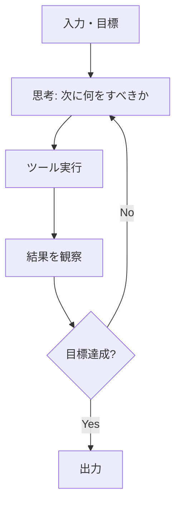
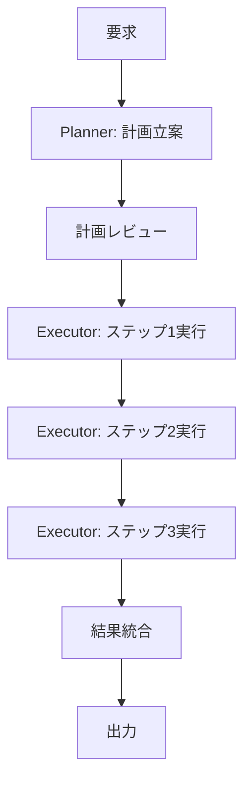
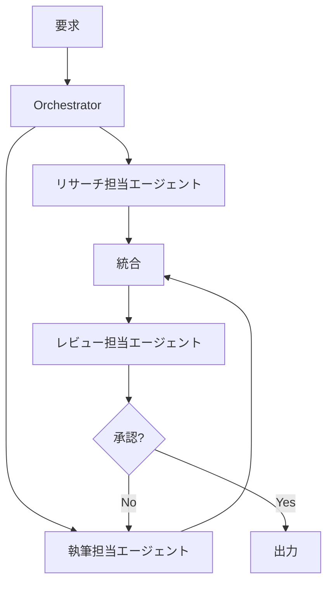
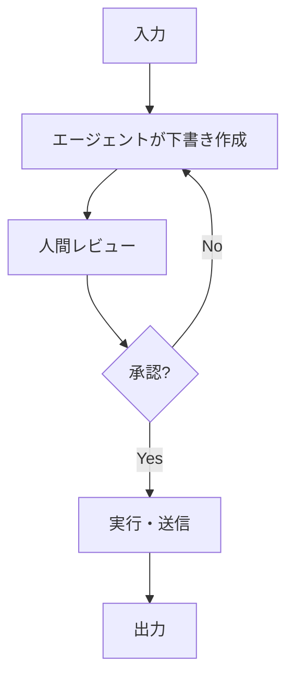

# フェーズ1: ワークフロー分解の型

要件（フェーズ0）を、実装可能な「入力 → 処理ステップ → 出力」の流れに変換する。

## 分解の手順

1. **入力と出力を両端に固定する**。まず確定している両端から埋める。
2. **中間ステップを動詞で列挙する**（「取得する」「要約する」「判定する」「実行する」「通知する」）。名詞（「要約」「判定」）で止めず、必ず動作まで分解する。
3. **各ステップに以下を付与する**:
   - 入力・出力の形式
   - 前提条件（このステップが動く条件）
   - 分岐条件（失敗時、情報不足時、承認拒否時にどこへ行くか）
   - ループの有無（結果が基準を満たすまで繰り返すか）
4. **ステップ間の依存関係を確認する**。並列にできるステップはないか。
5. **どの設計パターンに近いか判定する**（下記）。
6. **Mermaidで可視化する**。

> より高度・網羅的なパターン（Anthropic「Building Effective Agents」の5ワークフローパターン＋自律エージェント、ワークフローvsエージェントの区別、中核原則）は [`13-advanced-agent-patterns.md`](./13-advanced-agent-patterns.md)。ここは基本形、13は上位版。

## 代表的なエージェント設計パターン

### 1. 線形パイプライン（Linear Pipeline）
入力を順番に処理して出力する。分岐・ループがほぼない。最もシンプルで、デバッグしやすく、コストも読みやすい。
- 向いている: 定型業務の自動化（議事録要約→アクション抽出→投稿、など）
- 向いていない: 判断が毎回変わる、試行錯誤が要るタスク

### 2. ReActループ（Reason + Act）
「考える→ツールを使う→結果を見る→また考える」を、終了条件を満たすまで繰り返す。汎用エージェントの基本形。
- 向いている: 未知の情報を都度調べながら進める必要があるタスク（リサーチ、デバッグ、複雑な問い合わせ対応）
- 向いていない: 手順が完全に決まっているタスク（コストが無駄にかかる）

### 3. Planner-Executor（計画者・実行者分離）
最初に全体計画を立ててから、各ステップを別のプロセス（または別エージェント）が実行する。計画と実行を分けることで、暴走や無限ループを防ぎやすい。
- 向いている: 複数ステップにまたがる複雑なタスクで、途中経過を人間がレビューしたい場合
- 向いていない: 単純作業（オーバーヘッドが無駄）

### 4. マルチエージェント協調（Multi-Agent Orchestration）
役割の異なる複数エージェント（例: リサーチ担当・執筆担当・レビュー担当）が協調する。1つのエージェントに全部やらせるより役割特化で精度が上がることがある一方、コストとデバッグ難度は上がる。
- 向いている: 専門性が明確に分かれるタスク、相互レビューで品質を上げたいタスク
- 向いていない: シンプルなタスク（オーバーエンジニアリングになりやすい）。まず単一エージェントで足りるか検討してから採用する。

### 5. RAG（検索拡張生成）併用
生成の前に、社内文書やベクトルDBから関連情報を検索して根拠にする。ハルシネーション対策・専門知識の反映に使う。
- 向いている: 社内ナレッジ・最新情報・専門文書に基づいて回答する必要があるタスク
- 向いていない: LLMの一般知識だけで十分なタスク（検索基盤の構築・保守コストが無駄）

### 6. Human-in-the-Loop 承認
自動処理の途中、または最後に人間の承認ステップを挟む。誤りのコストが高い操作（外部送信、決済、削除など）に必須。
- 向いている: 取り返しのつかない操作を含むタスク全般
- 向いていない: 承認待ちが許容できないリアルタイム処理

## パターンの組み合わせ方

実際のエージェントは単一パターンで済まないことが多い。例えば「RAGで根拠を取ってからPlanner-Executorで実行し、外部送信の前だけHuman-in-the-Loopを挟む」といった組み合わせが普通。フェーズ1の出力では、どのステップがどのパターンに該当するかをステップごとに注記する。

## チェックリスト

- [ ] 入力・出力の形式が両端で確定している
- [ ] 全ステップが動詞で書かれている（名詞止めがない）
- [ ] 各ステップに前提条件・分岐条件がある
- [ ] ループが必要な箇所には終了条件が明記されている
- [ ] 誤りのコストが高い操作の直前にHuman-in-the-Loopがあるか検討済み
- [ ] Mermaid図を見て、他人が処理の流れを説明できる
