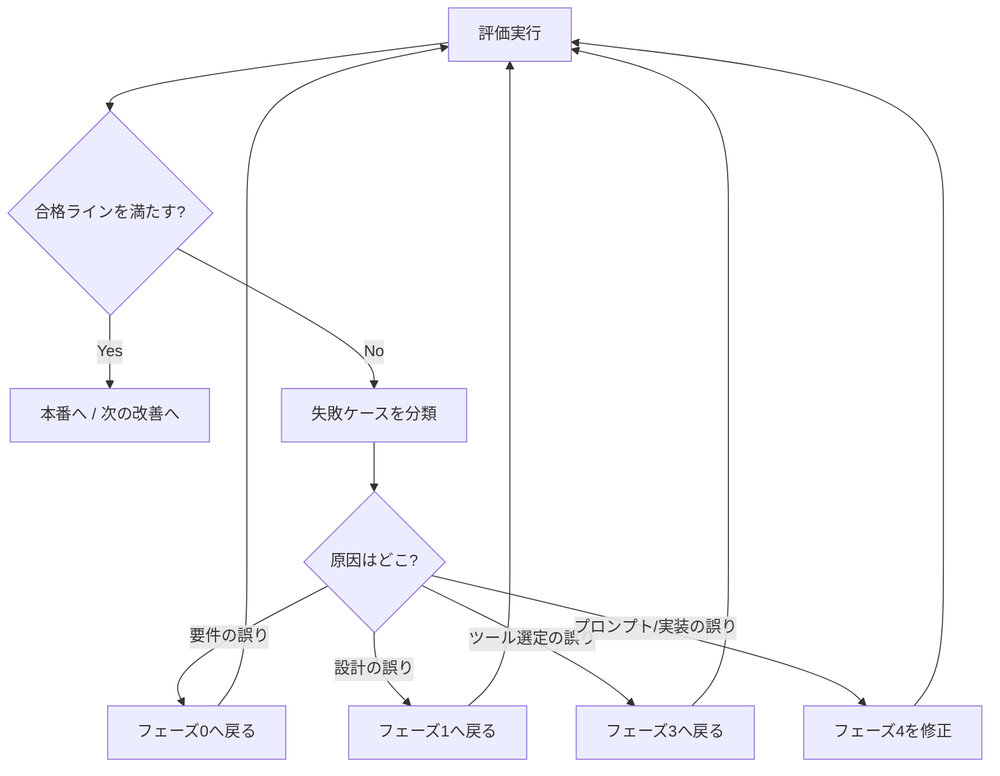

# フェーズ5: 評価・改善ループ

**評価の無いエージェントは「動いてるように見える」だけで本番に出せない。** 成果物と必ずセットで作る。

## なぜ評価を先に作るか

エージェントはプロンプトを1文字変えるだけで挙動が変わり、あるケースが直ると別のケースが壊れる（回帰）。目視確認だけでは回帰に気づけない。最初にテストセットを作っておけば、「変更して良くなったか／どこかを壊したか」を毎回数字で判定できる。

## ステップ1: ゴールデンテストセットを作る

代表的な入力と、その合格条件をペアで20〜50件用意する。以下の3種を必ず混ぜる。

1. **正常系**: 典型的な入力。期待する出力の必須要素を定義する。
2. **境界・難所**: 曖昧な入力、長すぎる入力、複数の解釈があり得る入力。
3. **異常系・安全系**: 情報不足（推測せず確認を返すべき）、禁止された依頼（断るべき）、機密情報を含む入力（外部に出さないべき）。

合格条件は「完全一致」で書けないことが多いので、**必須要素(must_include)・禁止要素(must_not_include)・構造(JSONとして妥当か等)** で判定できる形にする。フォーマットは [`05-build-and-output-templates.md`](./05-build-and-output-templates.md) のテンプレHを使う。

## ステップ2: 評価指標を決める

タスクの性質で使い分ける。

| タスクの型 | 主な指標 | 評価方法 |
|---|---|---|
| 分類・抽出（正解が一意） | 正解率、適合率/再現率 | 期待値との自動比較 |
| 生成（正解が一意でない） | 有用性・正確性・形式順守 | ルーブリック採点、LLM-as-a-judge、人間評価 |
| ツール実行・エージェント動作 | タスク完了率、ステップ数、コスト、レイテンシ | 実行ログの集計 |
| 安全性 | 禁止出力の発生率、機密漏洩の有無 | フィルタ・ルールチェック |

**LLM-as-a-judge を使う場合の注意**: 採点者LLMにも癖がある。最初に人間が採点した20件と、LLM採点の結果がどれだけ一致するかを必ず確認する。相関が低いなら採点プロンプトを直すか、人間評価に戻す。

## ステップ3: 評価を自動で回せるようにする

手動評価は続かない。最低限、コマンド1つで全テストケースを流して「passed/failed とどのケースがなぜ落ちたか」が出る状態にする。可能ならCIに組み込み、プロンプト・コード変更のたびに自動実行する。

規模が大きい・継続運用するなら、評価/トレーシングプラットフォーム（[`04-tool-selection-matrix.md`](./04-tool-selection-matrix.md) カテゴリ7）で実行トレース・スコア推移・回帰を追う。

## ステップ4: 改善ループを回す

**失敗の原因を「プロンプトのせい」で片付けない。** 失敗ケースを分類して、根っこがどのフェーズにあるかを見極める。要件があいまいだったならフェーズ0、設計パターンが不適切ならフェーズ1、モデルやツールが力不足ならフェーズ3に戻る。プロンプト微調整で潰せるのは一部だけ。

## ステップ5: 回帰を防ぐ

- 変更のたびに全テストセットを流す。新しく直したケースはテストセットに**追加**する（同じバグを二度出さない）。
- 本番で見つかった失敗は、必ずテストケース化してからパッチする。
- プロンプト・モデル・ツールのバージョンを記録し、「どの構成でどのスコアだったか」を辿れるようにする。

## 運用に入った後のモニタリング

- **コスト**: 1実行あたりのトークン・課金を監視。想定を超えたらモデルルーティングやキャッシュを検討。
- **レイテンシ**: 応答時間の分布を監視。悪化したらボトルネックのステップを特定。
- **失敗率・エスカレーション率**: エージェントが答えられず人間に回した割合。上昇はモデル/データ/要件のドリフトのサイン。
- **ユーザーフィードバック**: 実利用の「良かった/ダメだった」を回収し、テストセットに反映する。

## チェックリスト

- [ ] ゴールデンテストセットがある（正常系・境界・異常系を含む）
- [ ] コマンド1つで評価が回り、passed/failedが出る
- [ ] 合格ラインが数値で定義されている
- [ ] 失敗時にどのフェーズへ戻るかの判断基準がある
- [ ] 本番の失敗をテストケース化する運用が決まっている
- [ ] コスト・レイテンシ・失敗率のモニタリング方法が決まっている
