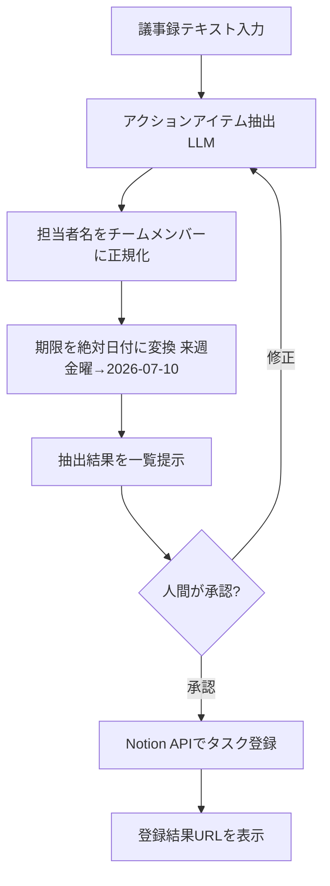

# 通し実演サンプル

キット全体をどう使うかを、1つの依頼で最初から最後まで流して見せる。型を掴むための例。

**依頼**: 「毎週の議事録から、担当者と期限つきのアクションアイテムを自動抽出して、NotionのタスクDBに登録するエージェントが欲しい」

---

## フェーズ0: 要件ヒアリング（[`01`](./01-intake-and-requirements.md)）

| 項目 | 確定内容 |
|---|---|
| 目的 | 議事録からアクションアイテム（担当者・期限つき）を抽出しNotionに登録。見直し時間を15分→2分に |
| 利用者 | 自分＋チーム5人。週1回の定例後に使う |
| 入力 | 議事録テキスト（Google Docsからコピペ、またはファイル） |
| 出力 | Notionタスクdbへの登録（タイトル・担当者・期限・元発言の引用）。登録前に人が確認 |
| 実行環境 | 週1・手動起動でよい。凝ったUIは不要 |
| 自律度 | Notion登録の前に人間承認（Human-in-the-Loop）。誤登録の手戻りが面倒なため |
| リソース | LLM APIキーあり。Notion APIトークン取得可。予算は月数千円以内 |
| 非機能 | レイテンシは数十秒でOK。議事録に人事系の機微情報がたまに含まれる→外部API送信の可否を要確認（今回は社内で許可済みと仮定） |
| **優先順位** | **保守性優先**（非エンジニアのチームメンバーも将来いじれる形が望ましい） |

→ 保守性優先・週1・低頻度・SaaS連携中心。これは「重いコードフレームワークより、ノーコード or 薄い実装」が有力、という当たりがつく。

---

## フェーズ1: ワークフロー分解（[`02`](./02-workflow-decomposition.md)）



- **パターン判定**: ほぼ線形パイプライン ＋ 登録直前に Human-in-the-Loop。ReActループやマルチエージェントは不要（抽出は1発、試行錯誤が要らない）。
- 分岐は「承認 or 修正」の1箇所のみ。

---

## フェーズ2: タスク・工数分解（[`03`](./03-task-and-effort-breakdown.md)）

| # | タスク | 説明 | 依存 | 工数(h) | 難易度 |
|---|---|---|---|---|---|
| 1 | 要件確定 | フェーズ0の文書化 | - | 1 | S |
| 2 | 抽出プロンプト設計 | 議事録→構造化JSON（担当・期限・引用）のプロンプト | 1 | 4 | M |
| 3 | 担当者正規化ロジック | 表記ゆれをメンバー名簿に突合 | 2 | 3 | M |
| 4 | 期限の日付正規化 | 「来週金曜」等を絶対日付へ | 2 | 2 | M |
| 5 | Notion API連携 | タスクDBへの登録（認証込み） | 1 | 6 | M |
| 6 | 承認UI | 抽出結果の確認・修正の受け口 | 3,4 | 4 | M |
| 7 | 全体結合 | 一連のフローとして繋ぐ | 5,6 | 4 | M |
| 8 | 評価セット | 過去議事録10本で抽出精度確認 | 2 | 4 | S |
| 9 | 評価・調整 | 抽出漏れ/誤りを見てプロンプト修正 | 7,8 | 6 | L |

- 合計: 34h。Notion連携は外部API連携なので **+30%補正**（6h→8h）。補正後 約36h。
- クリティカルパス: 1→2→3→6→7→9（約22h）。

---

## フェーズ3: タスクごとのツール選定（[`04`](./04-tool-selection-matrix.md)）

**保守性優先・週1・SaaS連携中心** という軸で、フロー全体の実現方式を比較する。

| 案 | 実装コスト | 運用コスト | 拡張性 | 学習コスト | 非エンジニア保守 | 保守性優先との整合 |
|---|---|---|---|---|---|---|
| A: n8n（ノーコード）+ LLMノード + Notionノード | 低 | 低 | 中 | 低 | ◎ GUIで追える | ◎ |
| B: Python薄実装（素のSDK直叩き）+ Notion SDK | 中 | 低 | 高 | 中 | △ コードが読める人限定 | ○ |
| C: LangGraph等の重いFW | 高 | 中 | 高 | 高 | ✕ | ✕ 今回は過剰 |

**推奨: 案A（n8n）**
理由: フェーズ0で保守性優先・非エンジニアも将来いじれる形が望ましいと確定。処理は線形＋承認1箇所で、重いオーケストレーションフレームワークの制御力は不要。n8nならトリガー・LLM呼び出し・Notion登録・承認待ちをGUIノードで組め、チームメンバーが後からステップを足せる。承認はn8nのWait/承認ノード、またはSlack承認で実装。
将来、抽出ロジックが複雑化してGUIで手に負えなくなったら、抽出部分だけ案Bのコードに切り出してHTTPノードから呼ぶ、という段階移行を想定。

**モデル選定**: 抽出タスク（構造化・そこそこの推論）なので、まず中位モデルで精度を確認し、足りれば軽量モデルへ落としてコスト削減を検討。機微情報の外部送信は社内許可済み（フェーズ0）。

---

## フェーズ3.5: プリミティブの探索・再利用・選定（[`08`](./08-agent-primitives-and-composition.md)）

各ステップを「新規に書く」前に、既存プリミティブを探索して割り付ける。今回は保守性優先でn8n主体だが、Claude Code/Agent SDK で組む別案も想定して探索結果を残す。

| ステップ | 探索結果 | 判定 | 割り付けるプリミティブ |
|---|---|---|---|
| アクション抽出 | 同等の既存スキル/サブエージェントなし | 新規（プロンプトが本体） | n8n案: LLMノード ／ Claude案: **スキル**（抽出手順を再利用） |
| Notion登録 | **公式NotionのMCPサーバーが存在** | 再利用 | 既存MCPサーバーを接続（自作しない） |
| 承認 | Human-in-the-Loop | 新規 | n8n承認ノード ／ Claude案: `disable-model-invocation` の登録スキル（人が明示起動） |
| 過去議事録での一括評価（大量読み込み） | ビルトインの Explore が読み取り専用探索に最適 | 再利用 | **Explore サブエージェント**に隔離して評価を回す |

- **最大の再利用ポイント**: Notion連携は自作せず既存の公式MCPサーバーを使う。これでフェーズ2のNotion連携タスク（8h）が接続設定のみ（1〜2h）に縮む。
- **このエージェント自体のプリミティブ判定**: 定例後に人が起動し、抽出結果を対話的に確認する運用なので、Claudeで組むなら本体は**スキル**（`/extract-actions`）が正解。評価の大量読み込みだけ Explore サブエージェントへ逃がす（スキル×サブエージェントの合成）。
- 探索を省いて全部フルスクラッチで書いていたら、MCPの再利用に気づかず工数を無駄にしていた。**フェーズ3.5を通すこと自体が成果物の質を上げている。**

## フェーズ4: 成果物生成（[`05`](./05-build-and-output-templates.md)）

**抽出プロンプト**（テンプレAベース。n8nのLLMノードに設定）:
```
# 役割
あなたは議事録からアクションアイテムを抽出する専門アシスタント。

# 入力
会議の議事録テキスト。

# 出力
以下のJSON配列のみを返す。前後に説明文を付けない。
[
  {
    "title": "アクションの内容（動詞で始める）",
    "assignee": "担当者名（議事録中の表記のまま）",
    "due": "期限の表現（議事録中の表現のまま。無ければ null）",
    "quote": "根拠となった議事録中の該当箇所（原文引用）"
  }
]

# 制約
- 議事録に明記されたアクションのみ抽出する。推測で追加しない。
- 担当者・期限が不明な項目も、title と quote は必ず埋め、不明欄は null にする。
- 決定事項・共有事項（アクションでないもの）は含めない。

# 例
入力: 「田中さんが来週金曜までにAPI設計書をレビューする件、お願いします」
出力: [{"title":"API設計書をレビューする","assignee":"田中","due":"来週金曜","quote":"田中さんが来週金曜までにAPI設計書をレビューする件"}]
```

- 担当者正規化・期限の日付正規化は、n8nのFunction/Setノードで名簿突合と日付計算を行う（基準日=会議日を渡す）。
- Notion登録は n8nのNotionノードで、DBのプロパティ（タイトル/担当/期限/引用）にマッピング。
- 承認は、抽出結果をSlackに整形して投げ、承認ボタンで先へ進める構成。

（コードで作る場合は [`05`](./05-build-and-output-templates.md) テンプレB＋MCP/SDKで同じ処理を実装できる。）

---

## フェーズ5: 評価・反復（[`06`](./06-evaluation-and-iteration.md)）

**ゴールデンテストセット**（過去議事録10本、`evalset.jsonl`）:
```jsonl
{"id":1,"input":"（正常系）田中さんが来週金曜までに設計書レビュー","must_include":["設計書","田中"],"must_not_include":[]}
{"id":2,"input":"（アクション無し）今日は進捗共有のみ","must_include":[],"must_not_include":["title"]}
{"id":3,"input":"（担当不明）誰かがドキュメントを更新する必要がある","must_include":["null"],"must_not_include":[]}
{"id":4,"input":"（機微情報）人事評価の議事録","must_include":[],"must_not_include":["外部漏洩すべき情報"]}
```

- **指標**: 抽出漏れ率（本来あるべきアクションを取りこぼした割合）と誤抽出率（アクションでないものを拾った割合）。保守性優先でも、抽出漏れは信頼を失うので漏れ率を主指標にする。
- **合格ライン**: 過去10本で抽出漏れ0、誤抽出は人が消せるので許容。
- **改善の戻り先**: 漏れが多い→プロンプト（フェーズ4）。担当者の突合ミスが多い→正規化ロジック（フェーズ4のノード）。「そもそも議事録の粒度がバラバラで抽出不能」なら入力フォーマットの見直し＝フェーズ0へ戻る。
- **回帰防止**: 本番で漏れた議事録は必ずテストセットに追加してからプロンプトを直す。

---

## この例から読み取るべきこと

- 優先順位（今回は**保守性**）が、フェーズ3で重いフレームワークを退けてノーコードを選ぶ決定打になった。**フェーズ0の優先順位確定が全ての分岐を決める。**
- 「線形＋承認1箇所」という単純なワークフローに、マルチエージェントやLangGraphを持ち込まない。**パターン判定で最小構成を選ぶ。**
- 成果物は「プロンプト文面」「ノード構成」「テストセット」まで具体化した。助言で終わらせない。
- 将来の複雑化に対して「どこを切り出してコード化するか」の移行方針まで示した。**最初から最強を作り込むのでなく、伸ばせる形で最小から始める。**
