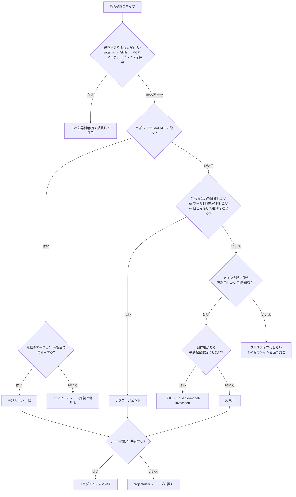

# フェーズ3.5: エージェント・プリミティブの探索・選定・合成

**このキットの心臓部。** 「エージェントを作る」とは、ゼロからコードを書くことではない。**まず既存のプリミティブ（サブエージェント/スキル/スラッシュコマンド/MCPサーバー/プラグイン）を探索し、読み込み、再利用できるものを選び、足りない分だけ新規に作る**——この探索と選定を毎回やる。ここを飛ばして最初からフルスクラッチで書くエージェントは、車輪の再発明をして工数を溶かす。

> このファイルはClaude Code / Claude Agent SDK 環境を主対象に、公式仕様（`code.claude.com/docs`）に基づいて書いている。他のフレームワーク（LangGraph等）でも「再利用可能な部品を探してから作る」という原則は同じ。仕様の細部はバージョンで変わるので、実装時は必ず最新の公式ドキュメントで確認する（Claude Code環境なら `claude-code-guide` サブエージェントや公式ドキュメントに当たる）。

---

## 0. まず「新規に作らない」を疑う（再利用優先の原則）

エージェントの構成要素を1つ作ろうとするたびに、この順で問う。

1. **すでに存在しないか？** ビルトイン・既存プロジェクト・ユーザー設定・プラグイン・公式/コミュニティのマーケットプレイスに、同じ役割のものが無いか探す。
2. **既存を組み合わせて済まないか？** 単体では足りなくても、複数の既存プリミティブの合成で要件を満たせないか。
3. **既存を薄く拡張して済まないか？** 既存のスキル/サブエージェントの description やツール制限を調整するだけで足りないか。
4. **どうしても無いものだけ新規に作る。** その際も、後で再利用できる粒度（1つの責務）で作る。

**探索を省略した提案は、このキットでは不採用。** 「新しくサブエージェントを書きましょう」の前に、必ず「既存に何があるか調べた結果、無かった／不十分だった」を根拠として示す。

---

## 1. プリミティブの全体像（何を選ぶのか）

Claude Code / Agent SDK で「エージェント的な振る舞い」を組む部品は複数ある。役割が違うので、要件をこれらに割り付けるのがフェーズ3.5の仕事。

| プリミティブ | 一言でいう役割 | 実行コンテキスト | 主なファイル |
|---|---|---|---|
| **スキル (Skill)** | 再利用したい手順・知識・チェックリストを注入する | メイン会話**内**（デフォルト） | `.claude/skills/<name>/SKILL.md` |
| **スラッシュコマンド** | ユーザーが `/name` で明示起動する手順（スキルに統合済み） | メイン会話内 | `.claude/commands/<name>.md`（=スキルと等価） |
| **サブエージェント (Subagent)** | 独立コンテキストで自律作業させ、要約だけ返す | **別**のコンテキストウィンドウ | `.claude/agents/<name>.md` |
| **MCPサーバー** | 外部ツール・データソースを標準プロトコルで接続する | ツールとして各所から利用 | `.mcp.json` / サーバー実装 |
| **プラグイン** | 上記をまとめて配布・共有する単位 | インストール先で有効化 | plugin の各ディレクトリ |
| **Agent SDK** | Claude Code外で自律エージェントをプログラムから動かす | 自前のプロセス | コード |

**核心の対比（ここを間違えると設計を誤る）:**

- **スキル = メイン会話の中で動く。** 会話の文脈を共有し、手順や知識をその場に注入する。コンテキストを消費するが、対話の流れに沿う。
- **サブエージェント = 別のコンテキストで動く。** 会話履歴を見ず、タスクだけ渡され、**要約だけ**を親に返す。大量の出力（テスト結果・ログ・大量ファイル読み）を親の文脈から隔離するのに最適。
- 迷ったら公式の基準: 「再利用したいプロンプト/ワークフローをメイン会話の文脈で走らせたい」→ **スキル**。「冗長な出力を隔離し、ツール制限をかけ、自己完結して要約を返させたい」→ **サブエージェント**。

---

## 2. サブエージェント（Subagent）— 正確な仕様と選定

### いつ使うか（公式の判断基準）
**サブエージェントを使う:**
- タスクが**冗長な出力**を生み、メイン文脈に残す必要がない（テスト実行、ドキュメント取得、ログ処理、大規模検索）
- 特定の**ツール制限・権限**を強制したい（読み取り専用の調査役など）
- 作業が**自己完結**していて、要約を返せば足りる
- 速い/安いモデル（Haiku等）に**ルーティングしてコスト**を下げたい

**メイン会話のままにする:**
- 頻繁な往復・反復的な擦り合わせが要る
- 複数フェーズが大きな文脈を共有する（計画→実装→テスト）
- ちょっとした局所修正
- レイテンシが重要（サブエージェントは毎回文脈をゼロから集めるので立ち上がりに時間がかかる）

### ファイルの形（`.claude/agents/<name>.md`）
```markdown
---
name: code-reviewer
description: Expert code review specialist. Proactively reviews code for quality, security, and maintainability. Use immediately after writing or modifying code.
tools: Read, Grep, Glob, Bash
model: inherit
---

You are a senior code reviewer ensuring high standards of code quality and security.

When invoked:
1. Run git diff to see recent changes
2. Focus on modified files
3. Begin review immediately
（…システムプロンプト本体…）
```

### フロントマターの主要フィールド（`name` と `description` のみ必須）
| フィールド | 役割 |
|---|---|
| `name` | 小文字とハイフンの一意な識別子（必須） |
| `description` | **いつ委譲すべきか**。Claudeはこの文でデリゲート先を選ぶ（必須）。「use proactively」等を入れると自動委譲されやすい |
| `tools` | 使えるツールの許可リスト。省略時は親から全継承。`Skill`を列挙するよりスキルは`skills`で入れる |
| `disallowedTools` | 拒否リスト（継承ツールから除外）。`tools`と併用時は先に拒否が適用される |
| `model` | `sonnet`/`opus`/`haiku`/`fable`/フルID/`inherit`。省略時`inherit`。安いモデルにルーティングしてコスト制御 |
| `permissionMode` | `default`/`acceptEdits`/`auto`/`dontAsk`/`bypassPermissions`/`plan` |
| `skills` | 起動時にサブエージェントの文脈へ**全文注入**するスキル群（description だけでなく本文が入る） |
| `mcpServers` | このサブエージェント専用のMCPサーバー（メイン会話に出さずに使える＝親の文脈を汚さない） |
| `memory` | `user`/`project`/`local`。会話をまたいで学習を蓄積する永続メモリ |
| `maxTurns` | 暴走防止の最大ターン数 |
| `isolation: worktree` | 独立したgit worktreeで動かし、編集を親のチェックアウトから隔離 |
| `hooks` | このサブエージェント稼働中だけ動くライフサイクルフック |

（プラグイン由来のサブエージェントでは `hooks`/`mcpServers`/`permissionMode` は無視される、等の制約がある。実装時に確認。）

### ツール制限の作法
- **許可リスト（`tools`）** か **拒否リスト（`disallowedTools`）** で絞る。読み取り専用にしたければ `tools: Read, Grep, Glob, Bash` のように書き、Write/Editを与えない。
- MCPサーバー単位でも制御可能: `mcp__<server>` や `mcp__<server>__*`。
- **原則: 必要最小限の権限だけ与える**（セキュリティと集中のため）。
- **サブエージェントでは使えないツールがある**（`tools` に書いても無効）: `AskUserQuestion` / `EnterPlanMode` / `ExitPlanMode`（permissionModeがplanの場合を除く）/ `ScheduleWakeup` / `WaitForMcpServers`。**ユーザーとの対話が要る処理はサブエージェントに切り出せない**——これがスキル（メイン会話）との使い分けの決定要因になる。

### モデル選定でコストを制御する
公式が明記する強力な使い方: **速く安いモデル（Haiku等）にサブエージェントをルーティング**する。調査・分類・大量処理はHaiku、難しい推論だけSonnet/Opus、というルーティングでコストと精度を両立する。

### 合成パターン
- **高volume処理の隔離**: 「サブエージェントでテストを流し、失敗したテストとエラーだけ報告して」
- **並列リサーチ**: 独立した調査を複数サブエージェントで同時実行し、親が統合（互いに依存しない時に有効）
- **チェーン**: 「code-reviewerで性能問題を洗い出し、次にoptimizerで直して」——各サブエージェントが結果を返し、親が次へ文脈を渡す
- **ネスト**: サブエージェントがさらにサブエージェントを spawn（深さ制限あり）

### ビルトイン・サブエージェント（まず再利用を検討する相手）
- **Explore**: 高速・読み取り専用のコードベース探索（Haiku）。ファイル発見・コード検索。
- **Plan**: プランモードで使う調査役（読み取り専用）。
- **general-purpose**: 探索も変更もする万能型（全ツール）。
- その他 `statusline-setup`, `claude-code-guide`（Claude Code機能の質問はこれ）など。
- **`/agents` コマンド**で一覧・作成・編集・削除ができる。**まずここで既存を見る。**

### fork（会話を継承する特殊サブエージェント）
通常のサブエージェントが**まっさらな文脈**で始まるのに対し、**fork はそれまでの会話全体を継承**して分岐する。system prompt・ツール・モデルもメインと同一。fork のツール実行はメイン会話に出ず、**最終結果だけ**が戻る（出力の隔離は保たれる）。
- 起動: `/fork <指示>`（例: `/fork ここまでのパーサ変更のユニットテストを下書きして`）。バックグラウンドで走り、パネルから観察・追加指示できる。
- **使いどころ**: 名前付きサブエージェントに渡すには背景説明が多すぎるサイドタスク／同じ地点から複数アプローチを並行で試す。
- **コスト面の利点**: system prompt とツール定義がメインと同一なので**プロンプトキャッシュを共有**し、新規サブエージェントより初回が安い。
- 制約: fork は fork を生めない。ファイル編集を隔離したければ `isolation: "worktree"` を併用。

---

## 3. スキル（Skill）— 正確な仕様と選定

### いつ作るか（公式の判断基準）
- 同じ手順・チェックリスト・多段の手続きを**繰り返し貼っている**とき
- CLAUDE.md の一節が「事実」ではなく「手続き」に育ってしまったとき
- スキル本体は**使われる時だけロード**されるので、長い参照資料でも普段はコストがほぼゼロ

### ファイルの形（`.claude/skills/<name>/SKILL.md`）
```yaml
---
description: Summarizes uncommitted changes and flags anything risky. Use when the user asks what changed, wants a commit message, or asks to review their diff.
---

## Current changes
!`git diff HEAD`

## Instructions
Summarize the changes above in two or three bullet points, then list any risks...
```
- ディレクトリ名が `/コマンド名` になる（`summarize-changes/` → `/summarize-changes`）。
- 本体は**メイン会話に一度だけ注入され、以後セッション中ずっと残る**。だから簡潔に、恒常的な指示として書く。500行以内を目安に、詳細は別ファイルへ。

### フロントマターの主要フィールド（`description`のみ推奨）
| フィールド | 役割 |
|---|---|
| `name` | 表示名（省略時ディレクトリ名） |
| `description` | **何をする/いつ使うか**。Claudeがこの文で自動起動を判断。要点を先頭に（一覧では1,536文字で切られる） |
| `when_to_use` | 発動トリガーの補足（description に追記される） |
| `disable-model-invocation: true` | Claudeの自動起動を止め、`/name`の手動起動のみに。副作用のある操作（deploy/commit/送信）に使う |
| `user-invocable: false` | `/`メニューから隠す。Claudeだけが使う背景知識に使う |
| `allowed-tools` | このスキル稼働中に無承認で使えるツール（例: `Bash(git add *)`） |
| `disallowed-tools` | 稼働中に外すツール（自律ループで `AskUserQuestion` を封じる等） |
| `model` / `effort` | このスキル稼働中のモデル/推論強度の上書き |
| `context: fork` | **サブエージェントとして隔離実行**（本体がそのタスクプロンプトになる） |
| `agent` | `context: fork` 時に使うサブエージェント種別（`Explore`等） |
| `paths` | globに一致するファイル作業時だけ自動発動 |
| `argument-hint` / `arguments` | 引数のヒント・名前付き引数 |

### 強力な機能（設計の幅を広げる）
- **動的コンテキスト注入**: ` !`command` ` はスキルが渡る**前に**シェル実行され、出力がその場に差し込まれる。`!`git diff HEAD`` のように、生の現状データを根拠にできる（Claudeが実行するのではなく、前処理）。
- **プログレッシブ・ディスクロージャ**: `SKILL.md` は目次に徹し、詳細は `reference.md` / `examples/` / `scripts/` に置き、必要時だけ読ませる。長大な参照資料のコストを普段ゼロにする。
- **スクリプト同梱**: 任意言語のスクリプトを同梱・実行できる（可視化HTML生成など、プロンプト単体を超える能力）。パスは `${CLAUDE_SKILL_DIR}/scripts/...` で参照。
- **引数**: `$ARGUMENTS`, `$0`/`$1`, 名前付き引数で `/skill 引数` を受ける。
- **`context: fork`**: 明確なタスクを持つスキルをサブエージェントで隔離実行。**スキル×サブエージェントの合成の要。**

### スキル と サブエージェント の合成（両方向）
| 方向 | システムプロンプト | タスク | 追加ロード |
|---|---|---|---|
| スキルに `context: fork` | agent種別から | SKILL.md本体 | CLAUDE.md（Explore/Plan除く） |
| サブエージェントに `skills` | サブエージェントの本文 | Claudeの委譲メッセージ | 指定スキルの全文＋CLAUDE.md |

---

## 4. スラッシュコマンド / MCP / プラグイン / Agent SDK（残りのプリミティブ）

### スラッシュコマンド
`.claude/commands/deploy.md` と `.claude/skills/deploy/SKILL.md` は**どちらも `/deploy` を作り、等価**（カスタムコマンドはスキルに統合された）。新規は基本スキルで作る（対応ファイル・フロントマター等の機能が増えるため）。既存の `.claude/commands/` はそのまま動く。

### MCPサーバー（外部ツール接続の標準）
- 外部API・DB・SaaS・社内システムを**標準プロトコル**でツール化し、複数のエージェント/クライアントから再利用する。
- **再利用の探索対象**: 既存の公式/コミュニティMCPサーバー（GitHub、Slack、各種DB、ブラウザ操作など）が既にあることが多い。**自作の前に既存サーバーを探す。**
- サブエージェントの `mcpServers` にインライン定義すれば、そのサーバーのツールを**メイン会話に出さずに**特定サブエージェントだけに与えられる（親の文脈節約）。
- 詳細は [`04-tool-selection-matrix.md`](./04-tool-selection-matrix.md) カテゴリ5。

### プラグイン（配布単位）
サブエージェント・スキル・フック・MCPサーバーを**まとめて配布**する。チーム共有・マーケットプレイス配布はこの単位。**まずマーケットプレイスに要件を満たすプラグインが無いか探索**してから、自作を検討する。

### Agent SDK（Claude Code外で動かす）
Claude Codeの外、自前のプロセス/CI/サービスとして自律エージェントを動かすときの基盤。上記のサブエージェント・ツール制限・権限の考え方をプログラムから使う。ビルトインのサブエージェント型を無効化する環境変数などもある。詳細は公式の Agent SDK ドキュメント、また [`05-build-and-output-templates.md`](./05-build-and-output-templates.md) のテンプレG。

---

## 5. 選定の決定木（要件 → どのプリミティブか）



---

## 6. 探索・選定の実行手順（このキットの中核作業）

エージェントを構成するとき、各ステップについて次を必ず実行し、結果を根拠として残す。

1. **既存プリミティブを探索する**
   - ビルトイン・サブエージェント一覧（`/agents`）を見る。
   - 利用可能なスキル一覧（`/skills`、または「What skills are available?」）を見る。
   - 設定済みMCPサーバーと、公式/コミュニティのMCPサーバー・プラグイン・マーケットプレイスを検索する。
   - コードベースの `.claude/agents/`・`.claude/skills/`・`.mcp.json` を読む。
2. **候補を読み込む**: 見つかった候補の `description`・本文・`tools`・`model` を実際に読み、要件を満たすか判定する（名前だけで判断しない）。
3. **選定して根拠を書く**: 「再利用/拡張/新規」のどれかを、なぜそう決めたかと共に記録する。フォーマットは下記。
4. **新規作成分だけを設計する**: 足りない部分だけを、1責務・再利用可能な粒度で、正しいプリミティブとして作る（§5の決定木で種別を決める）。

### 選定アウトプットのフォーマット
```
### ステップ: 大量ログからのエラー抽出

探索結果:
- ビルトイン: Explore（読み取り専用探索）… ログ「実行」はできないため不十分
- 既存スキル: なし
- 既存/公式MCP: ログ基盤のMCPは今回未接続
判定: 新規サブエージェントを作る
理由: ログ実行は大量出力を生みメイン文脈を圧迫する。読み取り＋Bashに絞った
     サブエージェントで隔離し、エラー行だけ要約返却させる。model は haiku で
     コストを抑える（単純抽出のため高性能モデル不要）。
成果物: .claude/agents/log-triage.md（tools: Read, Grep, Bash / model: haiku）
```

---

## 6.5 プリミティブの安全設計（最小権限・信頼境界）

プリミティブを作る/選ぶときは、能力だけでなく**安全側の制約**も同時に決める。ここを省くと「動くが危ないエージェント」になる。

- **最小権限**: サブエージェント/スキルには必要なツールだけ与える。読み取りで足りるなら `tools: Read, Grep, Glob` に絞り Write/Edit を渡さない。MCPはサーバー単位で `mcp__<server>` を絞る。
- **`bypassPermissions` は原則使わない**: 承認を飛ばすため、`.git` 等への書き込みも通ってしまう。使うのは隔離環境や明確に許可された自動化だけ。通常は `default`／`acceptEdits` に留める。
- **副作用のある操作は手動起動限定に**: deploy・送信・課金・削除などは、スキルに `disable-model-invocation: true` を付けてClaudeの自動発動を止め、人が `/name` で起動する。または Human-in-the-Loop（[`02`](./02-workflow-decomposition.md) パターン6）を挟む。
- **信頼境界（プロンプトインジェクション）**: サブエージェント/エージェントが**外部の未検証データ**（Web・メール・PR本文・ログ・ユーザー投稿）を読む経路では、その内容に「指示」が混ざりうる前提で設計する。外部データを読む役と、破壊的操作を実行する役を**別プリミティブに分離**し、実行側に承認を挟む。入出力フィルタは [`04`](./04-tool-selection-matrix.md) カテゴリ8。
- **機密情報の外部送信**: 入力に個人情報・社外秘が含まれる場合、どのモデル/MCPに送ってよいかをフェーズ0で確定した方針に従う。送ってはいけないデータは、そのプリミティブに到達させない（前段でマスキング/除去）。
- **`allowed-tools` の信頼**: プロジェクトの `.claude/skills/` にある `allowed-tools` は、リポジトリを信頼した時点で無承認のツール権限を与える。他人のスキル/プラグインを入れる前に中身を読む。

## 7. このキット自身への適用（自己言及＝ドッグフーディング）

**「エージェントを作るエージェント」自身が、正しいプリミティブとして構成されているべき**——これは当然の要求で、キットはそれに答える。

- このビルダーは、**実際にこのリポジトリの `.claude/` に導入済み**。導入形はこのファイルの方法論で選定した:
  - **本体 = スキル**（`.claude/skills/agent-builder/SKILL.md`、`/agent-builder` で起動）。理由: フェーズ0の対話ヒアリングが核で、**`AskUserQuestion` はサブエージェントでは使えない**（§2の可用性制約）ため、メイン会話で動くスキルでしか成立しない。
  - **調査役 = サブエージェント**（`.claude/agents/agent-builder-researcher.md`）。フェーズ3.5の大量探索（既存プリミティブ・公式仕様・サードパーティ調査）を隔離し、要約だけ返す。読み取り＋Web系ツールに最小権限化。
  - **Explore は再利用**（同等の調査役を新規に作らない）。**MCPサーバーは追加しない**（WebSearch/WebFetchで足りる。必要が出るまで足さない＝§0の原則）。
  - 権限セットは `.claude/settings.json`（公式ドキュメントドメインのWebFetch等、調査系の最小allow。[`16 §2-5`](./16-claude-code-memory-and-permissions.md)の実践）。
- 他プロジェクトへの導入は `./install.sh /path/to/project`（スキル＋調査サブエージェント＋リファレンスキットをコピー）。
- テンプレも同梱している（キット無しで単体利用する場合や、全フェーズ自律実行版が欲しい場合）:
  - サブエージェント版: [`templates/agent-builder.subagent.md`](./templates/agent-builder.subagent.md)
  - スキル版: [`templates/agent-builder.SKILL.md`](./templates/agent-builder.SKILL.md)
- メタプロンプト本体（[`00-meta-agent-prompt.md`](./00-meta-agent-prompt.md)）には、**フェーズ3.5としてこの探索・再利用・合成を必須化**してある。だからこのビルダーに要件を渡すと、「まず既存を探す→無い分だけ、正しいプリミティブで作る」という順序が毎回強制される。

**要するに:** このキットは、指摘された「サブエージェント/スキルの探索・読込・選定」を、方法論（このファイル）・行動規範（メタプロンプトのフェーズ3.5）・自分自身の実装形（テンプレ）の3層で満たす。
