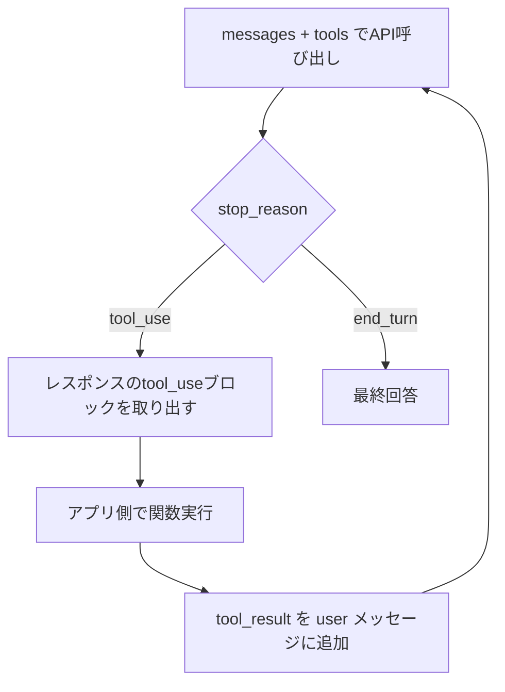

# Claude Code リファレンス③ ツール使用（API）とAgent SDKのカスタムツール

「あらゆるツールを実装できる」の低レイヤ。Claude Code外（自前アプリ/サービス/CI）で自律エージェントを作るときの基盤。公式仕様（`platform.claude.com/docs/.../tool-use`、`code.claude.com/docs/en/agent-sdk`）ベース。Academy「Building with the Claude API」の tool integration に対応。

> モデルID・SDKバージョン・ツールtype文字列は変わる。実装時に最新の公式ドキュメント／`claude-api` スキルで確認する。

---

## 1. API tool use（関数呼び出し）の基本

Claudeに「あなたが定義した関数」を呼ばせる仕組み。**クライアントツール**（あなたのアプリが実行）と**サーバーツール**（Anthropicが実行: web_search 等）がある。

### ツール定義（クライアントツール）
```python
tools = [
  {
    "name": "get_weather",
    "description": "指定地点の現在の天気を返す。都市名か座標が必要。",
    "input_schema": {                      # JSON Schema
      "type": "object",
      "properties": {
        "location": {"type": "string", "description": "都市名, 例 'Tokyo'"},
        "unit": {"type": "string", "enum": ["celsius", "fahrenheit"]}
      },
      "required": ["location"]
    }
  }
]
```
- `description` がClaudeの呼び出し判断の主材料。**いつ・何を返すか**を具体的に書く。
- `strict: true` を付けるとスキーマ厳密準拠を保証（Strict tool use）。

### 往復フロー（エージェントループ）


1. リクエストに `tools` と `messages` を渡す。
2. Claudeが `stop_reason: "tool_use"` と `tool_use` ブロック（`id`, `name`, `input`）を返す。
3. アプリが関数を実行し、結果を `tool_result`（`tool_use_id` で対応づけ）として `user` ロールで返す。
4. `stop_reason: "end_turn"` になるまでループ。

```python
import anthropic
client = anthropic.Anthropic()
MODEL = "claude-sonnet-5"  # 実装時に最新の適切なIDへ

messages = [{"role": "user", "content": "東京の天気は?"}]
while True:
    resp = client.messages.create(model=MODEL, max_tokens=1024, tools=tools, messages=messages)
    messages.append({"role": "assistant", "content": resp.content})
    if resp.stop_reason != "tool_use":
        print("".join(b.text for b in resp.content if b.type == "text")); break
    results = []
    for b in resp.content:
        if b.type == "tool_use":
            out = run_tool(b.name, b.input)             # あなたの実装
            results.append({"type": "tool_result", "tool_use_id": b.id,
                            "content": str(out)})        # 失敗時は "is_error": True も付与
    messages.append({"role": "user", "content": results})
```

### `tool_choice`（呼び出し制御）
| 値 | 挙動 |
|---|---|
| `{"type": "auto"}`（既定） | 毎ターン、呼ぶ/直接答えるをClaudeが判断 |
| `{"type": "any"}` | 必ず何らかのツールを呼ぶ |
| `{"type": "tool", "name": "X"}` | 特定ツールXを強制 |
| `{"type": "none"}` | ツールを呼ばせない |

- 呼ばせたい/抑えたいは system prompt でも操作可（「答える前にツールで調べよ」等）。
- **並列ツール使用**: Claudeは1ターンで複数 `tool_use` を返しうる。副作用のない読み取り系は並列化に向く。

### サーバーツール（Anthropic実行、ハンドラ不要）とAnthropicスキーマ・クライアントツール
- **サーバーツール**（Anthropic側で実行）: `web_search` / `web_fetch` / `code_execution` / `tool_search` / **`advisor`**（高速な実行モデルが、生成の途中で高知能モデルに難所だけ相談する） / MCP connector。`{"type": "web_search_20260209", "name": "web_search"}` のように type を渡すだけ。
- **Anthropicスキーマのクライアントツール**（スキーマはAnthropic提供・実行はあなたのアプリ）: `bash` / `text_editor` / `memory` / `computer use`。
- type文字列・バージョンは [Tool reference](https://platform.claude.com/docs/en/agents-and-tools/tool-use/tool-reference) で最新を確認。

---

## 2. RAG・マルチモーダル・構造化（Academy API講座の残り）

- **RAG**: 検索で取った文脈を messages に載せて根拠づけ。検索基盤は [`04`](./04-tool-selection-matrix.md) カテゴリ4。
- **マルチモーダル**: 画像等を content ブロックで渡す。ツール結果でも image ブロックを返せる（§3）。
- **構造化出力**: `strict` ツール / tool_choice で特定ツール強制 → スキーマ準拠のJSONを取り出す定番手法。SDKなら structured outputs 機能。
- **プロンプトキャッシュ**: 長い system/tools をキャッシュしてコスト削減（[`04`](./04-tool-selection-matrix.md) と併用）。
- **Batch API（Message Batches）**: 即時応答が不要な大量処理を**50%引き**で非同期実行。大規模評価（[`06`](./06-evaluation-and-iteration.md) のゴールデンセット一括実行に最適）、コンテンツモデレーション、データ一括分析など。`custom_id` 付きリクエスト群を投げてポーリングで回収（多くは1時間以内、上限24時間・1バッチ最大10万件/256MB）。
  ```python
  batch = client.messages.batches.create(requests=[
      {"custom_id": "eval-1",
       "params": {"model": "claude-haiku-4-5", "max_tokens": 512,
                  "messages": [{"role": "user", "content": "テストケース1..."}]}},
      # ... 数千件並べられる
  ])
  # batch.id をポーリング → processing_status が ended になったら結果を取得
  ```
  フェーズ0で「コスト優先＋リアルタイム不要」ならバッチ化を最初に検討する。

### Citations API（出典を構造化して返す）

RAGで「出典つき回答」を作るとき、プロンプトで「出典を書け」と頼むより**API機能のCitations**が確実。文書ブロックに `citations: {enabled: true}` を付けると、応答のtextブロックに**検証可能な出典**（どの文書のどの位置か）が構造化されて付く。

```python
msg = client.messages.create(
    model="claude-sonnet-5", max_tokens=1024,
    messages=[{"role": "user", "content": [
        {"type": "document",
         "source": {"type": "text", "media_type": "text/plain",
                    "data": "芝は緑である。空は青である。"},
         "title": "観察記録",
         "citations": {"enabled": True}},
        {"type": "text", "text": "芝と空は何色?"},
    ]}],
)
# 応答のtextブロックに citations が付く:
# {"type": "char_location", "cited_text": "芝は緑である。",
#  "document_index": 0, "document_title": "観察記録",
#  "start_char_index": 0, "end_char_index": 8}
```

- 位置型は文書種別で変わる: プレーンテキスト=`char_location`、PDF=`page_location`、カスタムコンテンツ=`content_block_location`。
- **プロンプトで引用させるより優れる点**: `cited_text` は**出力トークンに数えられず**（コスト減）、APIがパースして返すので**必ず実在の文書位置を指す**（偽の出典が構造上出ない）。
- 制約: structured outputs と併用不可。ほぼ全ての現行モデルが対応。
- RAG実装（[`05`](./05-build-and-output-templates.md) テンプレJ）で「出典必須」の要件があるなら、取得チャンクを `document` ブロック（`search_result` ブロック）で渡してCitationsを有効にするのが第一候補。

---

## 3. Agent SDK の in-process カスタムツール（別プロセス不要）

Claude Agent SDK で、別プロセスのMCPサーバーを立てずに**アプリ内関数をツール化**する。Claude Code の基盤と同じループを自前アプリで回せる。

ツールは4要素: **名前 / 説明 / 入力スキーマ / ハンドラ**。ハンドラは `content`（必須, ブロック配列）を返す。

### Python（`@tool` + `create_sdk_mcp_server`）
```python
from typing import Any
import httpx
from claude_agent_sdk import tool, create_sdk_mcp_server, query, ClaudeAgentOptions, ResultMessage

@tool("get_temperature", "指定座標の現在気温を返す", {"latitude": float, "longitude": float})
async def get_temperature(args: dict[str, Any]) -> dict[str, Any]:
    async with httpx.AsyncClient() as c:
        r = await c.get("https://api.open-meteo.com/v1/forecast",
                        params={"latitude": args["latitude"], "longitude": args["longitude"],
                                "current": "temperature_2m"})
    data = r.json()
    return {"content": [{"type": "text", "text": f"{data['current']['temperature_2m']}°"}]}

weather = create_sdk_mcp_server(name="weather", version="1.0.0", tools=[get_temperature])

async def main():
    options = ClaudeAgentOptions(
        mcp_servers={"weather": weather},
        allowed_tools=["mcp__weather__get_temperature"],  # 名前は mcp__<server>__<tool>
    )
    async for m in query(prompt="サンフランシスコの気温は?", options=options):
        if isinstance(m, ResultMessage) and m.subtype == "success":
            print(m.result)
```

### TypeScript（`tool` + `createSdkMcpServer`, Zodスキーマ）
```typescript
import { tool, createSdkMcpServer, query } from "@anthropic-ai/claude-agent-sdk";
import { z } from "zod";

const getTemperature = tool(
  "get_temperature", "指定座標の現在気温を返す",
  { latitude: z.number(), longitude: z.number() },
  async (args) => {
    const r = await fetch(`https://api.open-meteo.com/v1/forecast?latitude=${args.latitude}&longitude=${args.longitude}&current=temperature_2m`);
    const d: any = await r.json();
    return { content: [{ type: "text", text: `${d.current.temperature_2m}°` }] };
  }
);
const weather = createSdkMcpServer({ name: "weather", version: "1.0.0", tools: [getTemperature] });

for await (const m of query({ prompt: "SFの気温は?", options: {
  mcpServers: { weather }, allowedTools: ["mcp__weather__get_temperature"] } })) {
  if (m.type === "result" && m.subtype === "success") console.log(m.result);
}
```

### 押さえどころ
- **オプション引数**: TSは `.default()`。Pythonのdictスキーマは全キー必須なので、省略可はスキーマから外し description に書いて `args.get()` で読む。enumはPythonでは完全JSON Schema dictを直接渡す。
- **エラー処理**: ハンドラで**例外を投げるとエージェントループが停止**する。捕捉して `{"content": [...], "is_error": True}`（TSは `isError: true`）を返せばループ継続＝Claudeがリトライ/別手段を選べる。
- **注釈**: `readOnlyHint: true` を付けると副作用なしと分かり、他の読み取り系と**並列実行**できる（注釈は強制ではなくメタ情報）。
- **非テキスト返却**: `content` に `image`（base64, `mimeType`必須）/ `resource`（uri+text/blob）/ `audio` ブロックを混在可。
- **構造化返却**: `structuredContent`（JSON）を付けると機械可読フィールドとして渡る（Pythonのin-process版は非対応→標準MCPサーバーを使う）。
- **可用性 vs 権限**: `tools` オプションはビルトインの可用性、`allowedTools` は無承認化（権限）。`tools:[]` でビルトインを全消しし自作ツールだけにできる。
- **多数のツール**: [tool search](https://code.claude.com/docs/en/agent-sdk/tool-search) で必要時ロード（毎ターンのコンテキストコストを抑える）。

### Agent SDKの周辺機能（本番向け）
権限設定 / フック / サブエージェント / セッション永続化 / ストリーミング / コスト追跡 / OpenTelemetry可観測性 / structured outputs / secure deployment。詳細は各SDKページ。デプロイ・可観測性は [`06`](./06-evaluation-and-iteration.md)・[`04`](./04-tool-selection-matrix.md) と合わせる。

---

## 4. Claude Code のビルトインツール（公式リファレンス全43種）

自作ツールの前に、Claude Codeが標準で持つツールを把握する。ツール名は permission ルール・サブエージェントの `tools`・フックの matcher で使う正確な文字列。無効化は permission の `deny`。（公式 [tools-reference](https://code.claude.com/docs/en/tools-reference) の全ツール。追加・変更されるため実装時に原典確認。）

**ファイル・コード（読取/変更）**
| ツール | 説明 | 権限要 |
|---|---|---|
| `Read` / `Glob` / `Grep` | ファイル読取／パターン検索／内容検索（ripgrep） | 否 |
| `LSP` | 定義ジャンプ・参照・型エラー（言語サーバー） | 否 |
| `Edit` / `Write` / `NotebookEdit` | 部分編集／作成・上書き／Jupyterセル編集 | **要** |

**実行**
| ツール | 説明 | 権限要 |
|---|---|---|
| `Bash` / `PowerShell` | シェル実行（[sandbox](./17-claude-code-advanced-operations.md)対象） | **要** |
| `Monitor` | バックグラウンド実行の出力行を逐次フィードバック（WebSocket受信も可） | **要** |
| `TaskStop` / `TaskOutput` | 背景タスクの停止／出力取得（Outputは非推奨→出力ファイルをRead） | 否 |

**外部アクセス**
| ツール | 説明 | 権限要 |
|---|---|---|
| `WebFetch` / `WebSearch` | URL取得／Web検索 | **要** |
| `ListMcpResourcesTool` / `ReadMcpResourceTool` | MCPリソースの列挙／URI指定読取 | 否 |
| `ToolSearch` / `WaitForMcpServers` | 遅延ツールの検索ロード／接続待ち（tool search 有効/無効で排他） | 否 |

**委譲・オーケストレーション**
| ツール | 説明 | 権限要 |
|---|---|---|
| `Agent` | サブエージェント起動（別コンテキスト。[`08`](./08-agent-primitives-and-composition.md)） | 否 |
| `SendMessage` | サブエージェントの再開・[agent teams](./17-claude-code-advanced-operations.md) のメッセージ | 否 |
| `Workflow` | [dynamic workflow](https://code.claude.com/docs/en/workflows)（スクリプトが多数のサブエージェントを裏で編成し結果を統合） | **要** |
| `Skill` | スキルをメイン会話で実行（[`09`](./09-claude-code-skill-authoring.md)） | **要** |

**セッション制御・計画**
| ツール | 説明 | 権限要 |
|---|---|---|
| `EnterPlanMode` / `ExitPlanMode` | 計画モードへ／計画を提示して抜ける | 否/**要** |
| `EnterWorktree` / `ExitWorktree` | git worktreeの作成・移動／復帰（並列作業の隔離） | 否 |
| `TaskCreate` / `TaskGet` / `TaskList` / `TaskUpdate` | セッションのタスクリスト管理 | 否 |
| `TodoWrite` | 旧タスク管理（既定で無効化済み。Task系が後継） | 否 |

**スケジュール・通知・ユーザー連携**
| ツール | 説明 | 権限要 |
|---|---|---|
| `CronCreate` / `CronList` / `CronDelete` | セッション内スケジュール（[`17 §3`](./17-claude-code-advanced-operations.md)） | 否 |
| `ScheduleWakeup` | 自己調整 `/loop` の次回起動を予約（Claude が使う） | 否 |
| `RemoteTrigger` | claude.ai の Routines を作成・実行（`/schedule` の裏側） | 否 |
| `AskUserQuestion` | 選択式で要件・曖昧さを確認 | 否 |
| `PushNotification` | デスクトップ/スマホ通知（長時間タスクの完了連絡） | 否 |
| `SendUserFile` | 生成物（レポート・画像等）をユーザーのデバイスへ送付 | 否 |
| `ReportFindings` | コードレビュー所見を構造化して報告（`/code-review` 系が使用） | 否 |
| `Artifact` | HTML/Markdownを組織内共有のアーティファクトとして公開（Team/Enterprise） | **要** |
| `ShareOnboardingGuide` | ONBOARDING.md の共有リンク発行 | **要** |

- 一部はプラン・プロバイダ依存（`PushNotification`/`SendUserFile`/`RemoteTrigger` はBedrock/Vertex/Foundry不可、`Artifact` はTeam/Enterprise）。
- **カスタムツールを足す = MCPサーバーを繋ぐ**（[`10`](./10-claude-code-mcp-servers.md)）。**再利用可能なプロンプト手順を足す = スキル**（[`09`](./09-claude-code-skill-authoring.md)、既存の `Skill` ツール経由で動く＝新ツールは増えない）。

---

## チェックリスト
- [ ] クライアントツール（自前実行）かサーバーツール（Anthropic実行）か切り分けた
- [ ] `input_schema` を JSON Schema で厳密に定義（必要なら `strict: true`）
- [ ] エージェントループの終了条件（`end_turn`）と最大ターンを決めた
- [ ] ハンドラは例外を投げず `is_error` で返しループを止めない
- [ ] 副作用なしツールに `readOnlyHint` を付け並列化した
- [ ] ツール多数ならtool searchで遅延ロード
