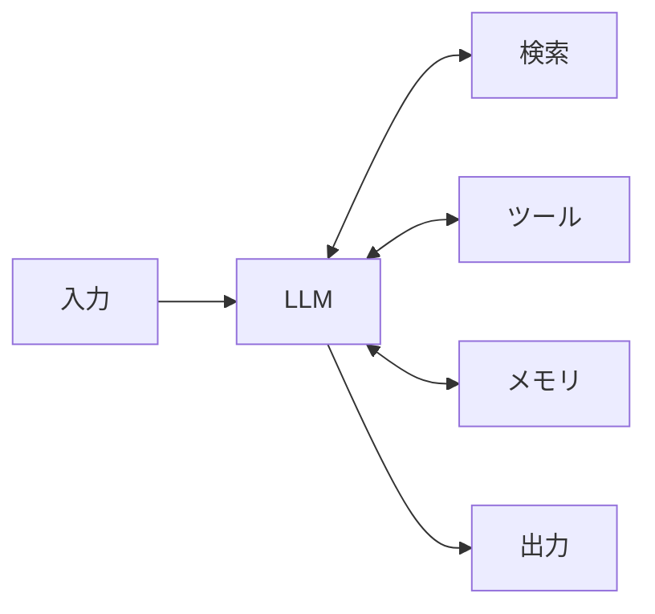
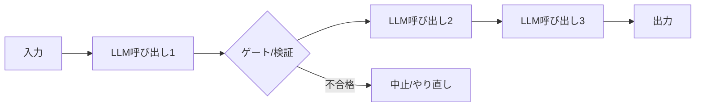
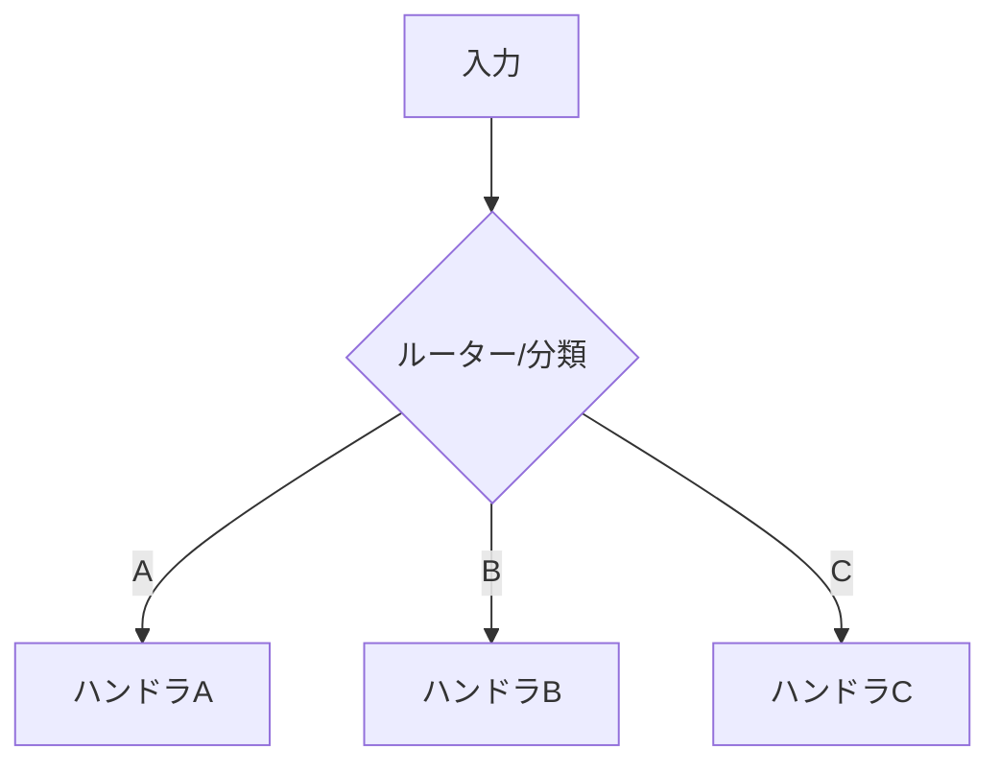
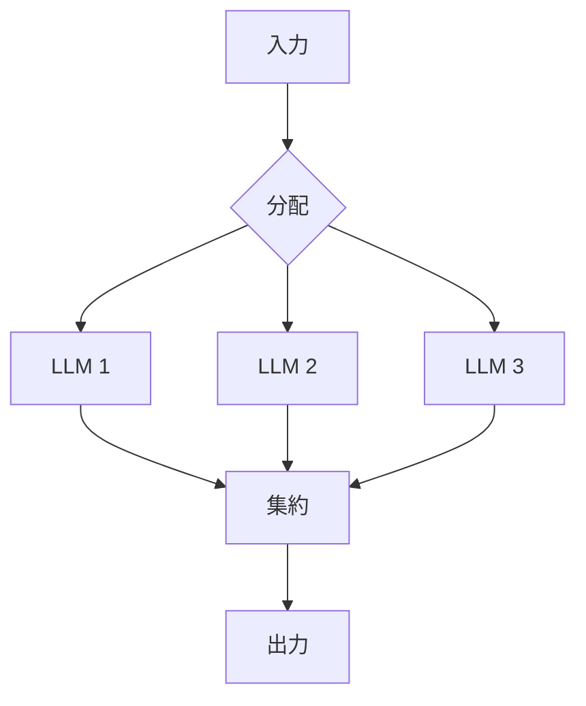
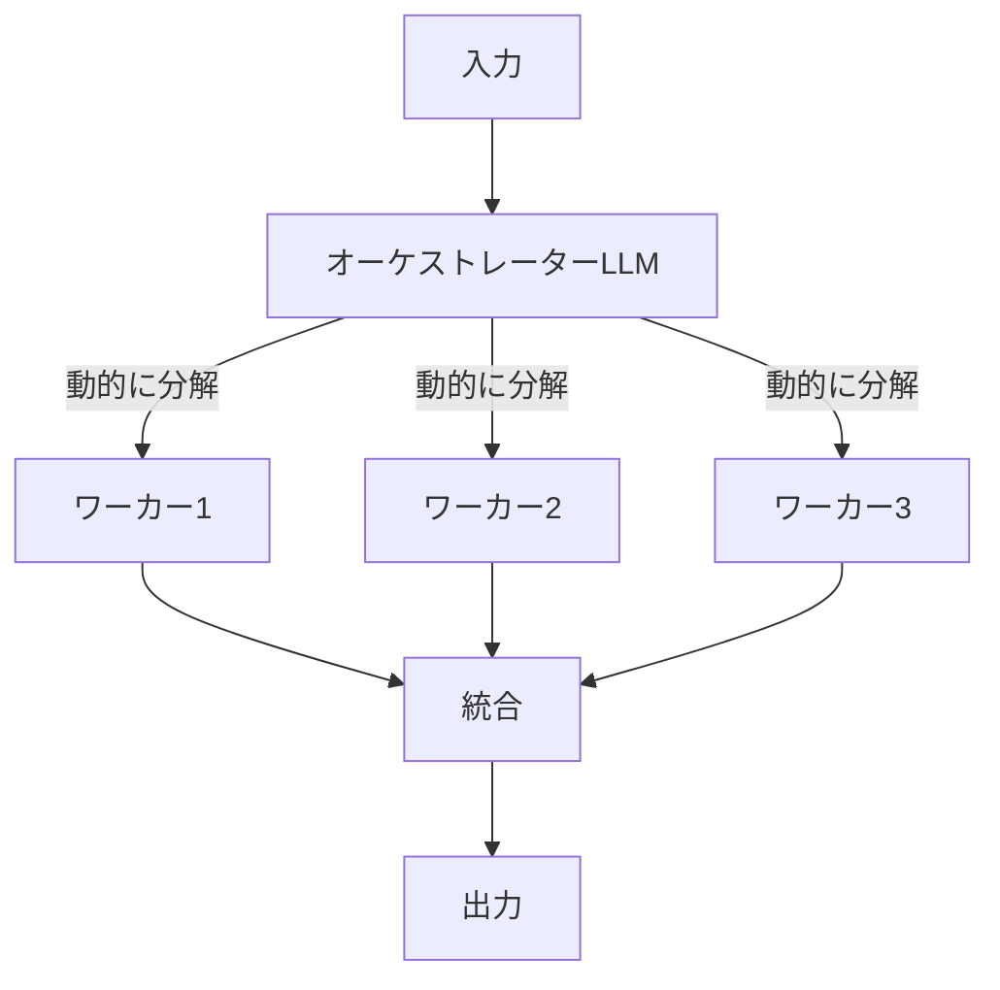
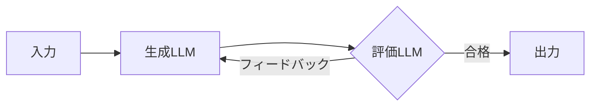
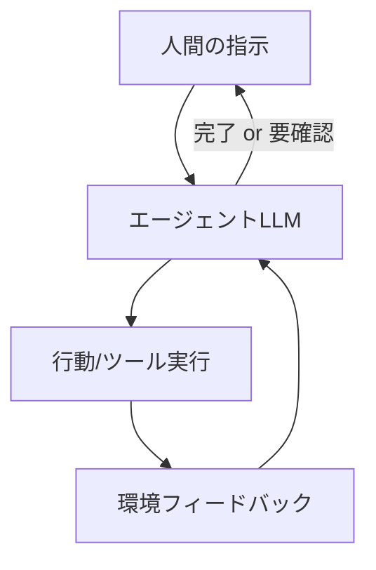

# 高度なエージェント設計パターン（Building Effective Agents）

Anthropic の「Building Effective Agents」に基づく、実効性の高いエージェント構成の正典パターン。[`02`](./02-workflow-decomposition.md) の基本6パターンの上位版で、フェーズ1（ワークフロー分解）とフェーズ3.5（プリミティブ選定）で使う。

> 出典: Anthropic Engineering "Building Effective Agents"（www.anthropic.com/engineering/building-effective-agents / research/building-effective-agents）。実装時に原典で最新を確認する。

---

## 0. 中核原則（パターンより先にこれ）

Anthropic の一貫した主張。**まずこれを守る。**

1. **シンプルさを保つ。** 最も成功しているのは、複雑なフレームワークではなく**シンプルで組み合わせ可能なパターン**。まず単一のLLM呼び出し＋検索/ツールで足りないか試す。
2. **必要な時だけエージェント性を足す。** エージェント（自律ループ）はレイテンシとコストを上げ、失敗の余地を増やす。**予測可能なワークフローで足りるなら、自律エージェントにしない。**
3. **透明性を保つ。** エージェントの計画・思考のステップを明示的に見せる（隠された多段推論より、追える構造）。
4. **ACI（Agent-Computer Interface）に投資する。** ツールのドキュメント・テストに、人間向けUI（HCI）と同じだけ手をかける。ツールの記述が悪いエージェントは、どんなに賢くても失敗する（詳細は [`14`](./14-prompt-and-context-engineering.md)）。

**「フレームワークを足す前に、生のAPIで組めないか」を常に問う。** 抽象化はデバッグを難しくし、不要な複雑さを隠す。

---

## 1. ワークフロー vs エージェント（最重要の区別）

| | ワークフロー | エージェント |
|---|---|---|
| 定義 | LLMとツールが**あらかじめ決めたコードパス**で協調 | LLMが**自分でプロセスとツール使用を動的に決める** |
| 予測可能性 | 高い（デバッグ・コストが読める） | 低い（自律的） |
| 向く場面 | タスクが分解でき、手順が定まっている | 手順を事前に予測できない、動的な判断が要る |
| 原則 | **まずこちらを試す** | 柔軟性とモデル主導の判断が大規模に必要な時だけ |

**判断:** タスクが明確に分解でき手順が定まる → ワークフロー。ステップ数や必要ツールが入力ごとに変わり事前に読めない → エージェント。

---

## 2. 基盤: Augmented LLM（拡張されたLLM）

全パターンの構成単位。単一のLLMに **検索（retrieval）・ツール（tools）・メモリ（memory）** を足したもの。

- Claude Code対応: 検索=RAG/[MCP Resources](./10-claude-code-mcp-servers.md)、ツール=[MCP/関数呼び出し](./11-claude-code-tool-use-and-sdk.md)、メモリ=サブエージェントの `memory`/外部state。
- **まずこの単体で要件を満たせないか試す。** 満たせない時だけ下記の合成に進む。

---

## 3. ワークフローの5パターン

### 3-1. プロンプトチェイニング（Prompt Chaining）
タスクを順次のLLM呼び出しに分解し、各ステップの出力を次に渡す。間に**ゲート（検証）**を挟める。
- **使う時**: タスクを固定した部分ステップにきれいに分解できる。各ステップを軽く・正確にしたい。
- **例**: マーケコピー生成→翻訳、アウトライン作成→（基準チェック）→本文執筆。
- **Claude Code対応**: 線形の[スキル](./09-claude-code-skill-authoring.md)連鎖、または[API tool useループ](./11-claude-code-tool-use-and-sdk.md)を段階化。

### 3-2. ルーティング（Routing）
入力を分類し、専門化したハンドラへ振り分ける。関心の分離＝各経路を個別最適できる。
- **使う時**: 明確に別カテゴリの入力があり、それぞれ別の扱い/モデルが要る（例: 問い合わせ種別で振り分け、簡単な質問は安いモデル・難問は高性能モデル）。
- **Claude Code対応**: 分類スキル →（種別に応じ）専門[サブエージェント](./08-agent-primitives-and-composition.md)や専門スキルへ委譲。安いモデルへのルーティングでコスト最適化。

### 3-3. 並列化（Parallelization）
複数のLLM呼び出しを同時に走らせる。2形態:
- **セクショニング**: タスクを独立部分に割り並列処理（例: 1つがコンテンツ生成、別が安全性チェック）。
- **投票（voting）**: 同じタスクを複数回走らせ多数決/集約（例: 脆弱性を複数視点でレビューし合議）。
- **使う時**: 部分タスクが独立して並列化できる、または多数決で信頼度/カバレッジを上げたい。
- **Claude Code対応**: [並列サブエージェント](./08-agent-primitives-and-composition.md)、[並列ツール呼び出し](./14-prompt-and-context-engineering.md)。

### 3-4. オーケストレーター・ワーカー（Orchestrator-Workers）
中央のオーケストレーターLLMが**動的に**サブタスクを分解し、ワーカーLLMに委譲、結果を統合する。並列化との違い: **サブタスクが事前に決まっておらず、入力に応じて動的に決まる。**
- **使う時**: 複雑で、必要なサブタスクを事前に予測できない（複数ファイルにまたがるコーディング、多面的な調査）。
- **Claude Code対応**: メインが[サブエージェント](./08-agent-primitives-and-composition.md)を動的に spawn／[dynamic workflows](https://code.claude.com/docs/en/workflows)。

### 3-5. エバリュエーター・オプティマイザー（Evaluator-Optimizer）
一方のLLMが生成し、もう一方が評価・フィードバックするループ。基準に達するまで反復。
- **使う時**: 明確な評価基準があり、反復的な洗練で質が上がる（翻訳の推敲、複雑な検索の網羅性向上）。人間のレビュアーの反復に相当する価値がある時。
- **Claude Code対応**: 生成スキル ⇄ レビュー[サブエージェント](./08-agent-primitives-and-composition.md)。プロンプトチェイニングの自己修正（[`14`](./14-prompt-and-context-engineering.md)）。

---

## 4. 自律エージェント（Autonomous Agents）

LLMが環境からフィードバックを受けながら、**自分でタスクを計画・実行・修正**する。人間の指示から始まり、独立して進み、必要に応じて人間に確認を戻す。
- **使う時**: ステップ数が予測できないオープンエンドな問題で、固定パスを敷けない。モデルの判断を信頼でき、失敗のコストを許容/検知できる。
- **必須の設計**: 停止条件（最大ターン/予算）、チェックポイント、**取り返しのつかない操作の前の人間確認**（[`14`](./14-prompt-and-context-engineering.md) の autonomy/safety）、進捗の永続化（[`14`](./14-prompt-and-context-engineering.md) の state管理）。
- **Claude Code対応**: [Agent SDK](./11-claude-code-tool-use-and-sdk.md) の自律ループ、`--agent`、permission mode、フックによるガード。

---

## 5. パターン選定の早見表

| 状況 | パターン |
|---|---|
| 単一呼び出し＋ツールで足りる | Augmented LLM のみ |
| 固定手順に分解できる | プロンプトチェイニング |
| 入力が明確に別カテゴリ | ルーティング |
| 独立部分の並列/多数決 | 並列化 |
| サブタスクが動的で予測不能 | オーケストレーター・ワーカー |
| 明確な基準で反復洗練 | エバリュエーター・オプティマイザー |
| 手順が完全に予測不能・オープンエンド | 自律エージェント |

**原則の再掲: 上から順に試し、要件を満たす最も単純なものを採る。** 複雑なパターンは、単純なパターンで測定可能に足りないと確認してから採用する。

---

## チェックリスト
- [ ] 「ワークフローで足りるか」を先に問い、不要な自律性を足していない
- [ ] Augmented LLM 単体で足りないと確認した上で合成に進んだ
- [ ] 選んだパターンが入力の予測可能性（固定/動的）と一致している
- [ ] 自律エージェントには停止条件・チェックポイント・人間確認を入れた
- [ ] 各パターンをClaude Codeのどのプリミティブで実装するか対応づけた
