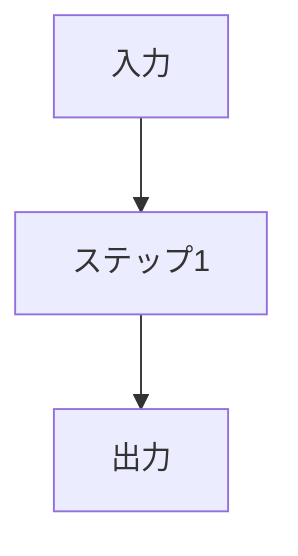

# ワークフロー分解シート（コピーして埋める）

## ステップ一覧

| # | ステップ(動詞で) | 入力 | 出力 | 前提条件 | 分岐条件 | ループ有無 |
|---|---|---|---|---|---|---|
| 1 | | | | | | |
| 2 | | | | | | |

## 設計パターン判定
- 該当パターン（線形/ReAct/Planner-Executor/マルチエージェント/RAG/Human-in-the-Loop）:
- 選んだ理由:

## フロー図

